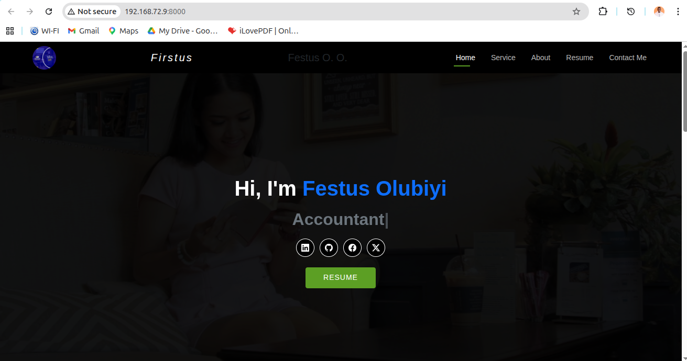
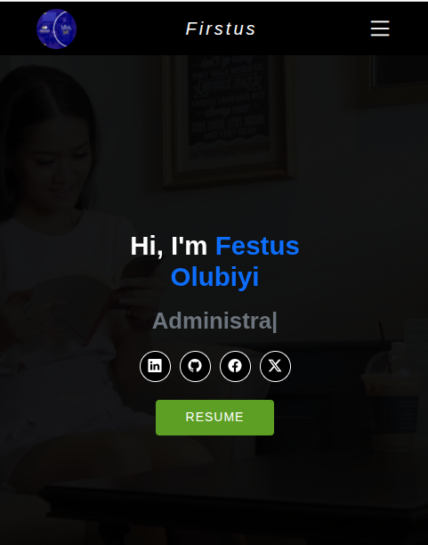

# Festus Tech Profile

---

## 🖼️ Preview

| Desktop View                                         | Mobile View                                         |
| ---------------------------------------------------- | --------------------------------------------------- |
|  |  |

---

## 📁 Repository & Contact

- **Repository:** [https://github.com/Firstus4/project](https://github.com/Firstus4/project)
- **Planned Domain:** [https://itsfirstus.com](https://itsfirstus.com)
- **Contact:** `festusolubiyi@gmail.com`

---

## 🧭 Overview

**Festus Profile** is a compact, secure, and modular Flask web application designed to serve as a digital technical résumé and project portfolio.  
It provides a simple yet scalable structure for personal branding, and portfolio demonstration.

The project includes:

- Responsive Bootstrap 5.3.8 front-end
- WSGI-ready deployment (`main.wsgi`)

---

## 🧰 Tech Stack

| Layer           | Technology                                 |
| --------------- | ------------------------------------------ |
| **Backend**     | Flask 3.x (Python 3.10+)                   |
| **Frontend**    | HTML5, Jinja2, Bootstrap 5.3.8, JavaScript |
| **Environment** | Python 3.10 – 3.12                         |

---

## 🏗️ Project Structure

```
Website/
├── /
│   ├── routes.py
│   ├── static/
│   └── templates/
├── .venv/
├── protected/
│   ├── Festus_Resume.pdf
├── images/
│   ├── preview-desktop.png
│   └── preview-mobile.png
├── app.py
├── README.md
└── requirements.txt
```

> The `website` directory contains all core Flask logic, static assets, and templates.

---

## 🚀 Quick Start (Development)

> Verified on Python 3.10 – 3.12

**Clone the repository**

```bash
git clone https://github.com/Firstus4/project.git
```

**Create and activate a virtual environment**

```bash
python -m venv venv
# macOS / Linux
source venv/bin/activate
# Windows (PowerShell)
venv\Scripts\Activate.ps1
```

**Install dependencies**

```bash
pip install -r requirements.txt
```

**Initialise and run**

```bash
python app.py
```

Access locally at: [http://127.0.0.1:8000/](http://127.0.0.1:8000/)

---

## 👤 Author

**Festus Olumuyiwa Olubiyi**  
Bsc (Economics) | HND (Business Administration) | OND (Business Administraion)

📧 `festusolubiyi@gmail.com`  
🌐 [https://itsfirstus.com](https://itsfirstus.com)
💻 [https://github.com/Firstus4/project](https://github.com/Firstus4/project)
